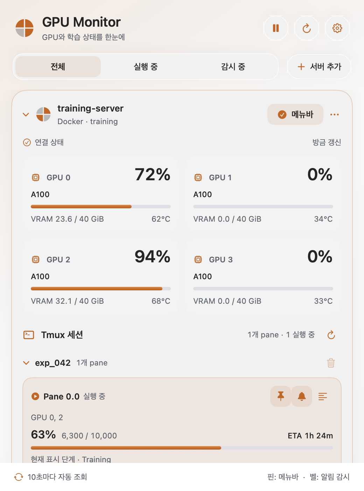
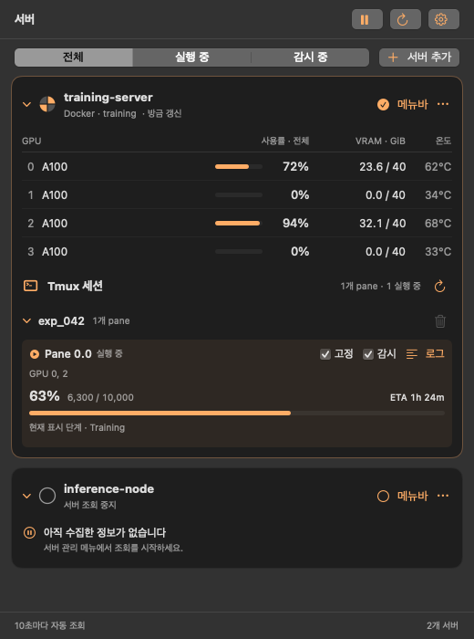
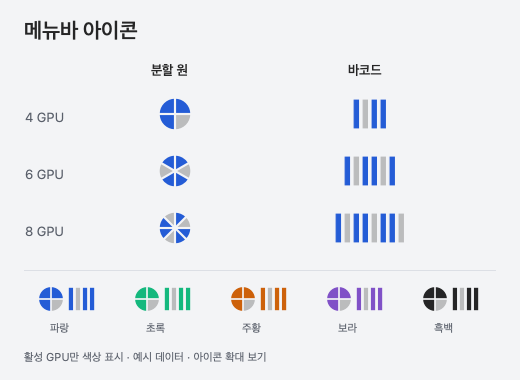
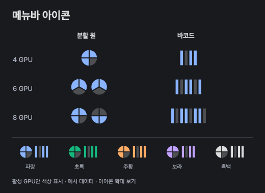

# GPU Monitor

**SSH 서버의 GPU와 학습 진행 상황을 macOS 메뉴바에서 확인하세요.**

[**⬇ macOS 앱 다운로드 · Apple Silicon**](https://github.com/HahnGyuTak/gpu-monitor/releases/latest/download/GPU-Monitor-macOS-arm64.zip) · [전체 릴리스](https://github.com/HahnGyuTak/gpu-monitor/releases) · [문제 제보](https://github.com/HahnGyuTak/gpu-monitor/issues)

SwiftUI와 AppKit으로 만든 작은 메뉴바 앱입니다. 기존 SSH 설정으로 여러 Linux 서버에 연결해 GPU 상태와 tmux 화면의 진행률·ETA를 읽습니다. 서버에 에이전트를 설치할 필요가 없습니다.

```text
◔  A100 72% · exp_042 · 63% · ETA 1h 24m
```

*표시 예시입니다. 진행률과 ETA는 선택한 pane의 로그에서 읽습니다.*

<p align="center">
  
  
</p>

*파랑을 선택한 예시 데이터의 정적 미리보기입니다. 이미지는 호환 머티리얼로 렌더링했으며, macOS 26 이상에서는 창과 섹션·조작부에 네이티브 Liquid Glass가 적용됩니다. [디자인 기준](docs/design.md) · [점검 결과](docs/design-audit.md)*

## 주요 기능

| 기능 | 설명 |
| --- | --- |
| 여러 SSH 서버 | SSH 별칭 또는 `user@host`로 등록하고 서버별 조회 제어 |
| GPU 상태 | GPU별 사용률, VRAM, 온도와 활성 GPU를 보여주는 분할 원 아이콘 |
| Liquid Glass 창 | 창·서버·설정·로그에 이어지는 Glass 재질, 가독성에 따른 투명도 구분 |
| 메뉴바 아이콘 | 분할 원 / 바코드 모양, 파랑·초록·주황·보라·흑백 선택 |
| 메뉴바 서버 선택 | 서버 카드의 **메뉴바** 버튼으로 표시할 서버 선택·저장 |
| 학습 진행률 | tmux의 tqdm, `step N/M`, `epoch N/M`과 ETA 감지 |
| 작업 고정·알림 | pane을 메뉴바에 고정하고 새 OOM·오류·프로세스 종료 알림 |
| tmux 관리 | 전체 목록 갱신, 최근 화면 확인, 빈 세션의 확인 후 삭제 |
| Docker 지원 | 지원하는 SSH `RemoteCommand` 해석과 호스트/컨테이너 GPU PID 매핑 |

## 다운로드와 실행

1. 위 **macOS 앱 다운로드** 링크에서 ZIP을 받습니다.
2. 압축을 풀고 `GPU Monitor.app`을 **응용 프로그램** 폴더로 옮겨 실행합니다.
3. 메뉴바 아이콘을 클릭하고 **서버 추가**에서 SSH 서버를 추가합니다.

**요구사항:** macOS 13 이상. 제공 앱은 **Apple Silicon(arm64)** 용입니다. Intel Mac은 소스에서 직접 빌드할 수 있지만 Intel 환경에서 검증하지 않았습니다.

현재 릴리스는 개발 서명된 앱이며 **Apple 공증을 받지 않았습니다**. 다른 Mac에서는 Gatekeeper가 실행을 차단할 수 있습니다. 배포자를 신뢰하는 경우 macOS의 **시스템 설정 → 개인정보 보호 및 보안 → 확인 없이 열기** 절차를 사용하거나 소스에서 직접 빌드하세요. 시스템 보안 기능을 전체적으로 끌 필요는 없습니다. SHA-256 체크섬은 릴리스의 `SHA256SUMS.txt`에 제공합니다.

## SSH 연결 준비

원격 Linux 서버에 `python3`, `nvidia-smi`, `tmux`가 있어야 합니다. 앱은 Mac의 `/usr/bin/ssh`, SSH 키, `~/.ssh/config`, `known_hosts`를 사용합니다. 비밀번호나 호스트 키 확인을 자동으로 우회하지 않으므로, 먼저 터미널에서 연결을 확인하세요.

```sshconfig
Host training-server
    HostName gpu.example.com
    User researcher
    IdentityFile ~/.ssh/id_ed25519
```

```bash
ssh training-server
```

앱의 **서버 추가 → SSH 설정**에서 `training-server`를 선택하면 됩니다. 신규 설치에는 기본 서버가 등록되어 있지 않습니다. 기존 사용자의 저장된 설정은 유지됩니다.

### Docker를 사용하는 경우

`RemoteCommand docker exec -it training-container /bin/bash` 같은 지원 패턴은 자동 인식합니다. 서버 추가의 **조회 대상**에서 **자동 감지**, **SSH 호스트**, **Docker**를 선택할 수 있습니다. Docker를 선택하면 컨테이너 이름을 입력합니다.

컨테이너 안에도 수집 도구가 필요합니다. 정확한 GPU–pane 매핑에는 호스트의 `python3`, `nvidia-smi`, Docker 조회 권한과 `/proc` 접근이 추가로 필요합니다. 매핑할 수 없으면 **GPU 연결 미확인**으로 표시하며 GPU/tmux 수집은 계속합니다.

## Liquid Glass 디자인과 색상

처음에는 메뉴바에 표시하는 서버만 펼치고 나머지 서버는 접습니다. 서버 헤더를 눌러 직접 펼치거나 접을 수 있으며, 자동 조회는 펼침 상태를 바꾸지 않습니다. 메뉴바 서버를 변경하면 새 서버가 펼쳐지고 이전 서버는 접힙니다.

**전체 / 실행 중 / 감시 중**, **분할 원 / 바코드**, 서버 추가의 조회 대상은 공통 Glass 선택 컨트롤을 사용합니다. 선택한 항목은 기본 Liquid Glass 효과와 체크 표시로 구분하며 색 테두리를 그리지 않습니다. 방향키로도 바꿀 수 있고, 키보드 탐색에는 시스템 포커스 표시를 사용합니다.

윈도우 배경부터 서버·설정 섹션, GPU·tmux 영역, 입력창과 로그까지 같은 Glass 재질로 연결했습니다. 창의 최하단에는 배경이 은은하게 비치는 기본 Glass 재질을 사용하고, 수치와 로그 뒤에는 더 짙은 표면을 사용합니다. 텍스트 자체는 흐리게 만들지 않습니다. 실제 창 바깥의 배경을 받는 AppKit Glass 안에 SwiftUI 화면을 넣었습니다. 선택한 서버는 기본 Glass 재질에 강조색이 스며들도록 표시하며, 메뉴바 체크 표시도 유지합니다. 메뉴바 화면도 독립 창과 같은 Glass 바탕을 쓰고, 아이콘을 다시 누르거나 바깥 클릭·Esc로 닫을 수 있습니다.

- **macOS 26 이상:** 네이티브 `NSGlassEffectView` 창, `glassEffect` 콘텐츠 표면과 `.glass`·`.glassProminent` 버튼 사용.
- **macOS 13–15:** 같은 배치의 표준 시스템 머티리얼과 macOS 컨트롤로 표시.
- **투명도 줄이기:** 불투명한 표면과 표준 버튼으로 전환합니다. **대비 증가:** 표면 경계를 강화합니다. 사용자 정의 등장 애니메이션은 없으며, 시스템 컨트롤의 포커스·키보드 동작을 유지합니다.
- **설정에서 고른 아이콘 색상:** 창의 GPU 사용률 막대, 학습 진행률 막대, 서버·GPU 아이콘과 조작 버튼에도 즉시 적용됩니다. 오류·경고는 의미를 유지하기 위해 빨강·주황을 사용합니다.

메뉴바 아이콘은 아래 설정에서 모양과 색상을 선택할 수 있으며, 선택은 재실행 후에도 유지됩니다.

## 메뉴바 아이콘 꾸미기

**설정(⚙) → 메뉴바 아이콘**에서 모양과 활성 GPU 색상을 고릅니다. 선택은 즉시 적용되고 앱을 다시 실행해도 유지됩니다.

- **분할 원:** GPU 1~8개를 원 하나에 표시합니다. 5개는 5분할, 6개는 6분할, 8개는 8분할이며, 12시부터 시계 방향으로 GPU 번호순입니다. 9개 이상은 별도 처리하지 않습니다.
- **바코드:** GPU마다 세로 막대 하나를 왼쪽부터 GPU 번호순으로 표시합니다. 높이는 일정하며 활성 GPU만 색이 들어옵니다.
- **색상:** 이름 대신 색상 원을 눌러 선택합니다. 선택한 색에는 바깥 링이 나타나며, 색상 이름은 툴팁과 VoiceOver로 확인할 수 있습니다. 파랑·초록·주황·보라·흑백을 제공하며 흑백은 macOS의 라이트·다크 모드에 맞춰 바뀝니다. 비활성 GPU는 흐린 중성색으로 표시합니다.

설정의 4·6·8 GPU 미리보기로 배치를 확인할 수 있습니다. 연결 끊김·일시 정지·갱신 지연 시에는 활성 색상을 끄고, 메뉴바 설명에 상태와 GPU 번호를 표시합니다. 모양 설정은 메뉴바에 적용됩니다. 선택한 색상은 메뉴바와 창 내부에 함께 적용되며, 서버 목록은 분할 원으로 GPU 상태를 표시합니다.

<p align="center">
  
  
</p>

*실제 아이콘 렌더러를 사용한 확대 예시입니다.*

## 사용 방법

- **서버 이름 왼쪽 원:** GPU 1~8개를 한 원으로 나누고 활성 GPU 조각만 선택한 색상으로 표시합니다. 4개일 때 GPU 0부터 우상단 → 우하단 → 좌하단 → 좌상단 순서입니다. 카드가 접혀 있어도 보입니다.
- **서버·세션 제목:** 클릭해 접거나 펼칩니다. 설정을 오가도 접기와 스크롤 위치가 유지됩니다.
- **서버의 메뉴바 버튼:** 해당 서버의 GPU 요약을 메뉴바에 표시합니다. 선택은 재실행 후에도 유지됩니다.
- **pane의 고정 체크박스:** 그 서버와 작업을 선택해 진행률·ETA를 표시합니다. 해제하면 같은 서버의 GPU 요약으로 돌아갑니다.
- **pane의 감시 체크박스:** 해당 pane의 새 오류·종료 감시를 켭니다. 설정에서 **macOS 알림**도 켜고 시스템 알림 권한을 허용하세요.
- **로그 버튼:** 최근 tmux 화면을 자동 갱신합니다. 수동 갱신, 줄바꿈 전환, 복사, 맨 아래 이동을 지원하며 작업 상태가 바뀌어도 열린 창을 유지합니다.
- **TMUX 옆 ↻:** 해당 서버를 즉시 갱신합니다. 상단 ↻는 활성 서버 전체를 갱신합니다.
- **설정:** 조회 간격(5/10/30/60초), 간결한 메뉴바, 알림과 앱 종료를 제공합니다.

**단축키:** `⌘R` 새로고침, `⌘N` 서버 추가(대시보드), `⌘,` 설정, `Esc` 보조창 닫기. 앱이 활성화된 상태에서 `⌘0` 모니터 창 열기, `⌘W` 창 닫기, `⌘M` 최소화, `⌘Q` 앱 종료. 입력창의 편집과 로그의 선택·복사에 macOS 기본 단축키를 사용할 수 있습니다.

서버 제거는 확인창을 거칩니다. 목록과 해당 서버의 고정·감시 설정만 지우며 원격 작업에는 영향을 주지 않습니다. 조회 재개 시에는 다음 주기를 기다리지 않고 즉시 상태를 갱신합니다.

메뉴바 팝오버의 **윈도우** 버튼을 누르면 크기를 조절할 수 있는 독립 창이 열립니다. 창 크기와 위치를 저장하며 다시 열 때 복원합니다. 창을 닫아도 메뉴바에서 실행됩니다. Mac이 잠들거나 앱이 종료되면 조회와 알림이 멈춥니다.

### 빈 세션 삭제

세션 옆 휴지통은 **모든 pane**에 실행 작업이 없다고 확인될 때 활성화됩니다. 확인창에서 **세션 삭제**를 누르면 해당 세션의 pane과 화면 기록이 삭제되며 복원할 수 없습니다.

백그라운드 작업, `tee`·`tail`, 로그 파이프, 연결된 tmux 클라이언트, 다른 세션과 공유하는 window가 있거나 프로세스 정보를 읽을 수 없으면 삭제를 막습니다. 삭제 직전 서버에서 다시 검사하고 세션 구성이 바뀌면 중단합니다. 폴링은 읽기 전용이며, 명시적으로 확인한 삭제만 원격 세션을 변경합니다. 다른 클라이언트의 동시 조작을 잠그는 기능은 아닙니다.

## 관측과 알림의 범위

- GPU 사용률은 **GPU 전체 기준**입니다. 활성 아이콘은 GPU 프로세스, 사용률, 연결된 실행 pane을 함께 확인합니다.
- 진행률은 로그에 보이는 **현재 단계**입니다. 검증이나 epoch 막대를 전체 학습 진행률로 간주하지 않습니다.
- 로그에 ETA가 없으면 관측한 step 증가로 추정합니다. 재연결·재시작·step 감소 시 추정치를 초기화합니다.
- 처음 연결했을 때의 과거 오류는 알리지 않습니다. SSH 실패도 작업 종료로 간주하지 않습니다.
- `100%`, GPU 0%, 프로세스 소멸만으로 성공을 확정하지 않습니다. 종료 코드가 없으면 **종료 · 원인 미확인**으로 표시합니다.
- OOM 알림은 새 로그에서 감지합니다. 로그가 폴링 전에 사라지거나 Mac이 잠들어 있으면 놓칠 수 있습니다.
- 평소 로그는 앱 메모리에서 처리하며 외부 분석 서비스로 보내지 않습니다. SSH 인증 정보를 별도로 복사하지 않습니다.

정확한 명령 종료 코드가 필요하면 선택적으로 `monitor-run`을 서버에 복사하고 tmux 안에서 사용하세요.

```bash
bash monitor-run python train.py --config experiment.yaml
```

앱이 이 스크립트를 자동 설치하지 않습니다. 종료 마커는 명령의 종료 코드를 뜻하며 학습 결과의 품질을 보장하지 않습니다.

## 소스에서 빌드

macOS, Swift 5.9 이상, Python 3, Xcode 또는 Command Line Tools가 필요합니다. **네이티브 Liquid Glass를 포함하려면 Xcode 26 이상(Swift 6.2+)으로 빌드하세요.** 구형 도구는 표준 머티리얼과 컨트롤을 사용하는 호환 경로를 빌드합니다. 외부 Swift/Python 패키지는 사용하지 않습니다.

```bash
git clone https://github.com/HahnGyuTak/gpu-monitor.git
cd gpu-monitor
bash test.sh
bash build.sh
open "dist/GPU Monitor.app"
```

- 앱: `dist/GPU Monitor.app`
- 빌드·테스트 캐시: `.build/`
- `DEVELOPER_DIR`: 사용할 Xcode/Command Line Tools를 명시할 때 지정
- `CODESIGN_IDENTITY`: 서명 인증서 지정. 미지정 시 설치된 Apple Development 인증서를 찾고, 없으면 ad-hoc 서명 사용

```bash
# 인증서 없이 로컬 빌드
CODESIGN_IDENTITY=- bash build.sh

# 배포 ZIP과 체크섬 생성
bash scripts/package.sh

# 창을 직접 열거나 SSH 수집을 진단
open "dist/GPU Monitor.app" --args --show-window
"dist/GPU Monitor.app/Contents/MacOS/GPUMonitor" --probe training-server
```

Ad-hoc 빌드는 macOS 알림 동작이 개발 서명 빌드와 다를 수 있습니다. 제공 릴리스는 개발 서명을 사용하지만 공증·Developer ID 배포를 대체하지 않습니다.

## 프로젝트 구조

```text
Sources/GPUMonitor/
  App.swift                 메뉴바와 앱 수명 주기
  Appearance.swift          라이트·다크 팔레트와 공통 화면 크기
  GlassAppearance.swift     Glass 표면·가독성·선택 재질과 공통 컨트롤
  WindowHosting.swift       실제 창의 Glass 안에 SwiftUI 화면 배치
  MenuBarPanel.swift        같은 Glass를 사용하는 메뉴바 패널과 화면 배치·닫기
  Views.swift               대시보드와 상단 탐색
  ServerViews.swift         서버 목록·GPU 행·세션·작업
  SettingsViews.swift       모양·모니터링·알림 설정
  SheetViews.swift          서버 추가와 실시간 로그 창
  Presentation.swift        작업 필터·정렬·표시 도우미
  Monitor.swift             폴링, 서버 선택, 알림
  Models.swift              설정과 관측 모델
  JobTracker.swift          작업 상태·ETA·이벤트 판정
  GPUPieIcon.swift           GPU 분할 원·바코드 배치와 렌더링
  SSHProvider.swift         SSH 실행과 수집 인터페이스
  Resources/
    collector.py            GPU·tmux 로그 수집
    host_pid_map.py         Docker PID 매핑
    tmux_sessions.py        세션 검사와 명시적 삭제
Tests/                      Python 및 Swift 검사
scripts/                    도구 환경과 릴리스 패키징
.github/workflows/ci.yml     macOS 테스트·빌드
```

`bash test.sh`는 Python 검사 37개와 Swift 검사 28개, 총 **65개**를 실행합니다. 실제 학습을 종료하거나 OOM을 유발하지 않으며 합성 관측과 제어된 테스트 객체로 상태 전이를 검증합니다.

W&B, Slurm, Kubernetes, AMD GPU, 사용자 지정 tmux 소켓과 로그인 시 자동 실행은 현재 지원하지 않습니다. W&B 같은 추가 데이터 소스를 연결할 수 있도록 `ObservationProvider` 인터페이스를 분리해 두었습니다.
